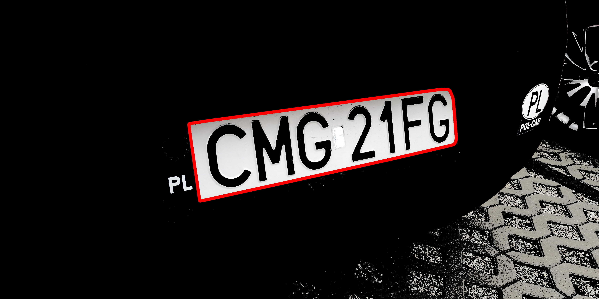

# License plate detection system
This repository contains an implementation of a license plate character recognition system developed using classical (non-machine learning) image processing techniques. Sample data with photos of license plates can be found below this [link](https://drive.google.com/drive/folders/1dXhLb5PWuLOIMa7_obCwuZajR8Ljx_Wh?usp=sharing).

## Image processing description
Pipeline of developed system can be divided into 3 parts:
- License plate contour extraction
- Perspective transformation
- Characters detection and recognition

### License plate contour extraction
Frst step in license plate countour detection creates a binary mask based on the white color in the HSV colorspace. The [Contour Finding](https://docs.opencv.org/3.4/d4/d73/tutorial_py_contours_begin.html) algorithm is then applied to the masks obtained in the previous step. Detected contours are filtered by area. In the next step for each contour, [rotated bounding rectangle](https://docs.opencv.org/3.4/d3/dc0/group__imgproc__shape.html#ga3d476a3417130ae5154aea421ca7ead9) is determined. Contours are filtered again by rectangle properties like width, height, aspect ratio, extent and solidity described [here](https://docs.opencv.org/3.4/d1/d32/tutorial_py_contour_properties.html). For each resulting contour [Convex Hull](https://docs.opencv.org/3.4/d3/dc0/group__imgproc__shape.html#ga014b28e56cb8854c0de4a211cb2be656) algorithm is apllied.

### Perspective transformation
Every operation described below is performed for each license plate contour detected in previous step. In order to determine the perspective transformation, it is crucial to find the four corners of the plate. These corners coordinates are calculated based on intersection points of four lines adjacent to the contour. These lines are obtained using [Hough Transform](https://docs.opencv.org/3.4/d9/db0/tutorial_hough_lines.html). Because this function usually returns multiple lines, they must then be divided into four subsets. Firstly they are divided between horizontal and vertical ones based on the slope angle. In both subsets lines are clustered then using [KMeans algorithm](https://docs.opencv.org/3.4/d1/d5c/tutorial_py_kmeans_opencv.html). The clustering is computed based on only one feature, which is 'x' coordinate of each vertical line in the middle of image height. Similarly for horizontal lines clustering is computed based on 'y' coordinate of each horizontal line in the middle of image width. In each of four subsets of lines, the line with median slope angle is obtained. Crossections of given median lines form the basis for [Perspective Transformation](https://docs.opencv.org/4.x/da/d54/group__imgproc__transform.html) method.

### Characters detection and recognition

First operation performed in this step involves applying [Gaussian blurring](https://docs.opencv.org/4.x/d4/d13/tutorial_py_filtering.html). The resulting image is transformed then into grayscale and thresholded into binary image. Basic [Morphological Operations](https://docs.opencv.org/4.x/d9/d61/tutorial_py_morphological_ops.html) like closing and opening are also perfomed, to filter out noise in the image. In the next step characters are detected using [Connected components](https://docs.opencv.org/4.x/d3/dc0/group__imgproc__shape.html#gae57b028a2b2ca327227c2399a9d53241) algorithm. Each detected blob is then filtered by parameters like: area, width and height. Detected characters are then divided into region code and the rest of license plate, based gaps between characters. [Template Matching](https://docs.opencv.org/4.x/d4/dc6/tutorial_py_template_matching.html) approach is used to perform characters recognition. Template characters are stored in *ocr_characters/* directory divided in two groups with different width parameter. Each character is cut out from the image, so the size of base and template in Template Matching is the same. The character with the biggest Template Matching score is returned to the final result.

